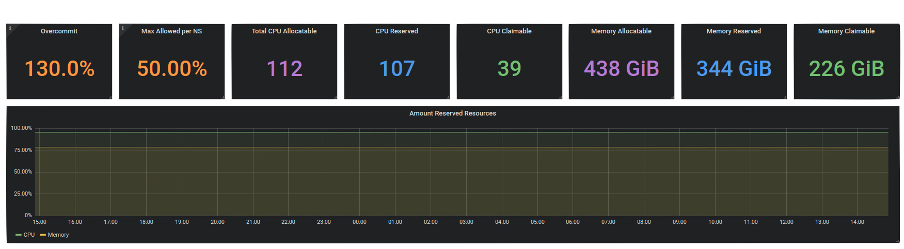
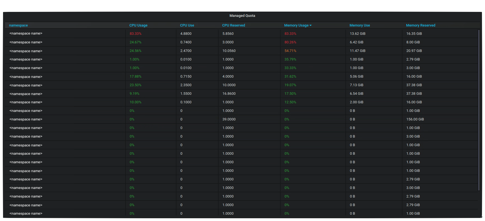
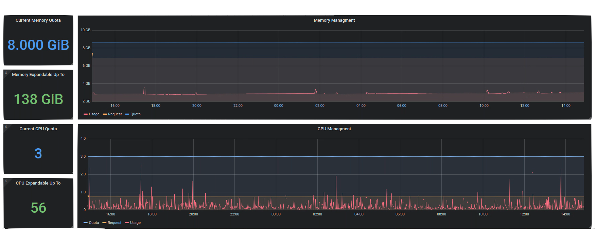

<center></center>
<br />

Managing Quota with confidence

# Kotary

<!-- START doctoc generated TOC please keep comment here to allow auto update -->
<!-- DON'T EDIT THIS SECTION, INSTEAD RE-RUN doctoc TO UPDATE -->
**Table of Contents**

- [What is it ?](#what-is-it-)
- [Why not use an admission controller ?](#why-not-use-an-admission-controller-)
- [Adding or Scaling-Up a Quota](#adding-or-scaling-up-a-quota)
- [Installation](#installation)
    - [Add the CRD](#add-the-crd)
    - [Configuration](#configuration)
      - [Options](#options)
      - [Example](#example)
    - [Deployment](#deployment)
      - [Deploy the controller](#deploy-the-controller)
      - [(Optional) Deploy the service monitor](#optional-deploy-the-service-monitor)
- [Getting Started](#getting-started)
  - [Update a ResourceQuota](#update-a-resourcequota)
    - [Example](#example-1)
    - [Status](#status)
      - [Example of a rejected claim](#example-of-a-rejected-claim)
      - [Example of a pending claim](#example-of-a-pending-claim)
  - [Default claim](#default-claim)
- [Plan](#plan)
- [Manage](#manage)
  - [Global](#global)
  - [Namespaces](#namespaces)
  - [Namespace Details](#namespace-details)

<!-- END doctoc generated TOC please keep comment here to allow auto update -->

## What is it ?

It is an operator that brings a layer of verification and policy to the native _ResourceQuotas_ mechanism.
It introduced a new resource call a _ResourceQuotaClaims_ that will let users ask to modify the specification of their quota.
The verification includes :
* There are enough resources (CPU and Memory) on the cluster to allocate the claim which will look at the total amount
of resources of the cluster (worker node) and the sum of all the other _ResourceQuotas_ 
* _(Optional)_ It respects the maximum bound value express as a ratio of the cluster resource,
ex: a namespace cannot claim more that a 1/3 of the cluster
* _(Optional)_ In order to have some flexibility it is possible to set an over-commit or under-commit ratio to set what
is claimable compared to the actual resources. 
ex: In a development environment you could choose to allow reserving more resources than what is actually usable in reality.

In order to facilitate the adaption of _ResourceQuotaClaims_ it is possible to enforce a default claim for namespaces.
The feature will be activated on namespace that contains the label __quota=managed__.

## Why not use an admission controller ?

It could have been an elegant solution to use the admission controller mechanism in Kubernetes. This would have avoided the use 
of a Custom Resource Definition by directly asking to modify a _ResourceQuotas_. In the meantime this would have left out users on 
managed cluster like EKS, AKS or GKE, this is why we implemented the operator pattern instead.

## Adding or Scaling-Up a Quota


## Installation

#### Add the CRD
```bash
kubectl apply -f artifacts/crd.yml
```

#### Configuration

##### Options

| Name                           | Description                                                | Mandatory   | Type           | Default                  |
| :--------------                | :--------------------------------------------------------: | :---------:  | :-------------: |:---------------------- |
|  **defaultClaimSpec**          |  *Default claim that will be added to a watched Namespace* | `no`        | `ResourceList` | cpu:2 <br /> memory: 6Gi |
|  **ratioMaxAllocationMemory**  |  *Maximum amount of Memory claimable by a Namespace*       | `no`        | `Float`        | 1                        |
|  **ratioMaxAllocationCPU**     |  *Maximum amount of CPU claimable by a Namespace*          | `no`        | `Float`        | 1                        |
|  **ratioOverCommitMemory**     |  *Memory over-commitment*                                  | `no`        | `Float`        | 1                        |
|  **ratioOverCommitCPU**        |  *CPU over-commitment*                                     | `no`        | `Float`        | 1                        |

##### Example

In the following sample configuration we set :
 * A default claim of 2 CPU and 10Gi of Memory
 * 33% of total amount of resource can be claim by a namespace
 * An over-commit of 130%

```bash
cat <<EOF | kubectl -n kube-system create -f -
apiVersion: v1
kind: ConfigMap
data:
  defaultClaimSpec: |
    cpu: "2"
    memory: "10Gi"
  ratioMaxAllocationMemory: "0.33"
  ratioMaxAllocationCPU: "0.33"
  ratioOverCommitMemory: "1.3"
  ratioOverCommitCPU: "1.3"
metadata:
  name: kotary-config
EOF
```

#### Deployment

##### Deploy the controller

```bash
kubectl apply -f artifacts/deployment.yml
```

##### (Optional) Deploy the service monitor 

```bash
kubectl apply -f artifacts/metrics.yml
```

## Getting Started

### Update a ResourceQuota

To update a _ResourceQuotas_ you will have to create a _ResourceQuotaClaims_ with specification for CPU and Memory.
You can use the same units as the one available in Kubernetes, 
please refer to the [official documentation](https://kubernetes.io/docs/tasks/administer-cluster/manage-resources/quota-memory-cpu-namespace/)

#### Example

```yaml
apiVersion: ca-gip.github.com/v1
kind: ResourceQuotaClaim
metadata:
  name: demo
spec:
  memory: 20Gi
  cpu: 5
```

#### Status

After creating a _ResourceQuotaClaims_ there are three possibilities:
* __Accepted__ : The claim will be deleted, and the modifications are applied to the _ResourceQuota_
* __Rejected__ : It was not possible to accept the modification the claim show a status "REJECTED" with details.
* __Pending__ : The claim is requesting less resources than what is currently requested on the namespace, the claim will be accepted once it's possible to downscale

##### Example of a rejected claim

```bash
$ kubectl get quotaclaim
NAME   CPU   RAM    STATUS     DETAILS
demo   5     20Gi   REJECTED   Exceeded Memory allocation limit claiming 20Gi but limited to 18Gi
```

##### Example of a pending claim

```bash
$ kubectl get quotaclaim
NAME   CPU   RAM    STATUS     DETAILS
demo   5     16Gi   PENDING    Awaiting lower CPU consumption claiming 16Gi but current total of CPU request is 18Gi
```

### Default claim

If you are using the default claim policy, namespace will automatically receive a claim and if all the verifications 
pass a managed-quota will be applied.

```bash
$ kubectl get resourcequota
NAME            CREATED AT
managed-quota   2020-01-24T08:31:32Z
```

## Plan

Implementing _ResourceQuota_ when you already have running workload on your cluster can be a tedious task.
To help you get started you can use our cli `kotaplan`. It will enable to test various scenarios beforehand
by simulating how the quota could be implemented according to the desired settings.

Here is a quick example

```bash
$ kotaplan -label quota=managed -cpuover 0.95 -memover 0.95 -memratio 0.33 -cpuratio 0.33
+---------------------------------------------------------------------------------------------------------------------------------------------------------------------------------------+
| Namespaces Details                                                                                                                                                                    |
+--------------+------+---------+-----------------+---------------+---------+-----------------+---------------+-------------+---------------------------+-------------------------------+
| NAMESPACE    | PODS | MEM REQ | CURRENT MEM USE | MEM REQ USAGE | CPU REQ | CURRENT CPU USE | CPU REQ USAGE | FIT DEFAULT | RESPECT MAX ALLOCATION NS | SPEC                          |
+--------------+------+---------+-----------------+---------------+---------+-----------------+---------------+-------------+---------------------------+-------------------------------+
| team-1-dev   |   14 | 7GiB    | 859.4MiB        | 11.9897 %     |    2800 |               6 | 0.2143 %      | false       | true                      | CPU : 3360m    MEM: 8.4GiB    |
| team-1-int   |   14 | 7GiB    | 852MiB          | 11.8868 %     |    2800 |               0 | 0 %           | false       | true                      | CPU : 3360m    MEM: 8.4GiB    |
| team-1-prd   |   16 | 8GiB    | 1.125GiB        | 14.0568 %     |    3200 |               0 | 0 %           | false       | true                      | CPU : 3840m    MEM: 9.6GiB    |
| team-2-dev   |   16 | 8GiB    | 1.119GiB        | 13.9935 %     |    3200 |               0 | 0 %           | false       | true                      | CPU : 3840m    MEM: 9.6GiB    |
| team-2-dev   |    8 | 4GiB    | 531.4MiB        | 12.9745 %     |    1600 |               0 | 0 %           | false       | true                      | CPU : 1920m    MEM: 6GiB      |
| team-2-dev   |   28 | 9GiB    | 1.033GiB        | 11.4748 %     |    3600 |               6 | 0.1667 %      | false       | true                      | CPU : 4320m    MEM: 10.8GiB   |
| team-3-dev   |    0 | 0B      | 0B              | 0 %           |       0 |               0 | 0 %           | true        | true                      | CPU : 1000m    MEM: 6GiB      |
| team-3-prd   |    0 | 0B      | 0B              | 0 %           |       0 |               0 | 0 %           | true        | true                      | CPU : 1000m    MEM: 6GiB      |
+--------------+------+---------+-----------------+---------------+---------+-----------------+---------------+-------------+---------------------------+-------------------------------+
| 8            |   96 |         |                 |               |         |                 |               |             |                           | CPU : 22692M    MEM: 64.8 GIB |
+--------------+------+---------+-----------------+---------------+---------+-----------------+---------------+-------------+---------------------------+-------------------------------+
+-------------------------------------------------------------+
| Summary                                                     |
+-------------------------------------------------------------+
| Number of nodes               8                             |
| Available resources (real)    CPU : 64000m    MEM: 250.5GiB |
| Available resources (commit)  CPU : 60800m    MEM: 238GiB   |
| Max per NS                    CPU : 21120m    MEM: 82.67GiB |
+-------------------------------------------------------------+
| RESULT                        OK                            |
+-------------------------------------------------------------+
```

## Manage

To help you manage effectively your _ResourceQuotas_ you can use the provided Granafa dashboard. You will be able
to set it up according to your configuration by modifying the dashboard variable.

### Global

The global section will enable users to check the current running configuration (manual) to size accordingly their claims.
It also shows what is currently available, reserved and claimable in terms of resources. 




### Namespaces

This section list all the managed namespaces to give a rough idea of what is currently use by running containers. It allows to 
rapidly checks which quota should be increased or decreased.



### Namespace Details

This section shows a detailed view of the Memory and CPU consumption on a particular namespace. It allows to visually check
what the specifications of the quota, the total amount of request made by containers and their real consumption.



